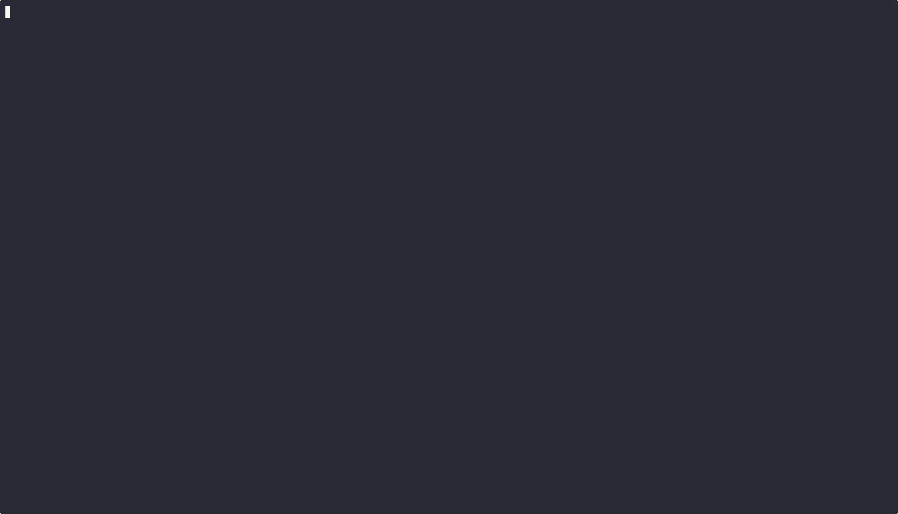

Small Bash-Like Shell in C++

This repository contains a small, Bash‑like shell implemented in modern C++ (C++23). It parses user input, supports basic quoting/escaping, runs common built‑ins, and executes external programs discovered via the PATH.

Demo

Features

- REPL prompt with line‑by‑line command execution
- Tokenizer with support for whitespace splitting, single/double quotes, and simple escapes
- Built‑ins: `exit`, `echo`, `type`, `pwd`, `cd` (with `~` expansion)
- External command execution via PATH lookup (POSIX‑style executability checks)
- Clear error messages for common cases (non‑existent commands, invalid `cd`, etc.)

Build

- Prerequisites: `cmake` (>= 3.13), a C++23 compiler, and `readline` library
- Steps:
  - `mkdir -p build && cd build`
  - `cmake -DCMAKE_BUILD_TYPE=Release ..`
  - `cmake --build . -j`

Run

- From `build/`: `./shell`
- Or use the helper script: `./your_program.sh`

Usage Examples

- `echo hello world`
- `echo "quoted text" and 'single quotes'`
- `pwd`
- `cd ~/projects` then `pwd`
- `type echo` (shows whether a command is a built‑in or external)
- `ls -la` (runs an external program if found in PATH)
- `exit` or `exit 2`

Project Layout

- `src/main.cpp` — REPL, built‑ins, PATH search and execution
- `include/tokenizer.h` / `src/tokenizer.cpp` — input tokenization with quotes/escapes
- `CMakeLists.txt` — build configuration (links against `readline`)

Notes & Limitations

- Redirection, pipes, variables, globbing, and job control are not implemented.
- Tokenizer reports unmatched quotes/escapes; improving error ordering vs. command existence is noted as a TODO in `src/tokenizer.cpp`.

License

- This is a learning project; no explicit license is provided. If you’d like to use parts of it, open an issue or reach out.

Contributing a Demo GIF

- Save a short terminal recording as `docs/demo.gif` (suggested: show `echo`, `pwd`, `cd`, an external `ls`, and `exit`).
- Popular ways to create a GIF:
  - asciinema + agg: record with `asciinema rec`, then `agg <cast.json> docs/demo.gif`.
  - peek/ksnip/kap or any screen recorder that exports GIFs.
